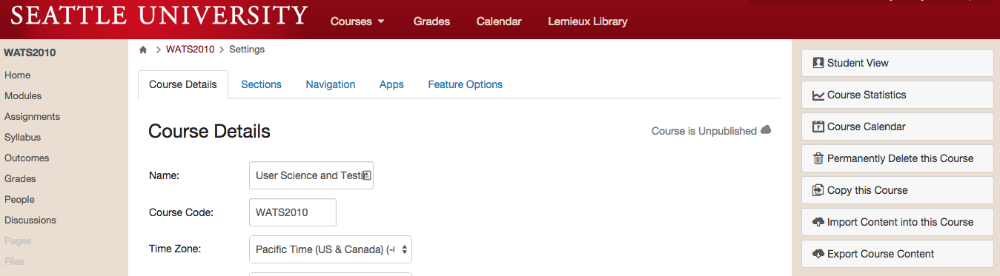

# Preparing Courses

When you get into your course for the first time, you will see an empty course shell. The Canvas LMS will encourage you to get building your course quickly. For WATS courses, we teach from common syllabi, so every course is a copy of the master version of the course. In order to prepare your course for students, you will need to copy the master version of the course into your new course, then you'll need to complete an audit checklist.

It's very important to be conscientious about looking for issues in the course before you publish it for student access. Although you can always fix issues that are noticed later (and you're expected to fix issues and notify the program director whenever they come up; see below), it's best to avoid issues in the first place. Encountering broken content or bad information in a course can ruin the experience for our students.

**Please Note**: The Course Prep process should happen **1-2 weeks before the quarter starts**. If there are issues completing any of the preparation steps, please contact the WATS Program Director.

## Step One: Copy the Course
To copy the master course into your course, complete the following steps:

First, Go to the Settings page in the course

Then, Click the link in the upper right that says "Import Course Content"

You will be presented with a drop-down menu. Select "Copy a Canvas Course" and search for courses with "MASTER" in their title:

Select the Master copy of the course you are teaching and then select "All Content". Also be sure to select the "Adjust events and due dates" checkbox.

## Step Two: Invite the Support Team
For some courses it may be beneficial to have observers or helpers who can assist you with different tasks. Be sure to invite these people using the `+ People` button on the People page of the course.

If this is the first course you're teaching for WATS, you must invite the WATS Program Director into your course as a Teacher.

## Step Three: Pre-Course Checklist
Complete the following checklist every time you copy a course into a new instance.

* Open the Assignments page and review the due dates for all assignments. Assignments should be due on the Sunday of each week at 11:59pm. Adjust any incorrect due dates.
* Review the Home page and verify that all of the links go to the proper Introduction page.
* Open the Modules page and click through every piece of content in the course using the "Next" button. On each page, verify the following:
    * Check every link on the page to verify it works. (We recommend using a link checker extension in your web browser. [Check My Links](https://chrome.google.com/webstore/detail/check-my-links/ojkcdipcgfaekbeaelaapakgnjflfglf/related?hl=en-GB) is a good one for Chrome.) 
    * Read all of the content of the course to refresh yourself with what the course is teaching.
    * Review the Rubrics on assignment pages to familiarize yourself with the Learning Outcomes stressed in the course.

Write up any issues you have found. In the case of broken links, list the old link, what Module it was in, and, if at all possible, a proposed replacement. Ultimately, you'll be responsible for updating the links in your copy of the course, so the faster you can identify replacements, the faster you can get your course properly set up.

## Step Four: Publish!
If you've completed your work on the course, Publish it! The Publish button is on the Home page of the course. Once you click Publish, students can access the course pages. If your course is NOT published, then students cannot access it.

## Step Five: Welcome Video & Message
Once you have the course prepped, you should create a welcome video for Week 0 just like you would for every other week. Post it at the top of the Home page like you normally would. In this video, you should discuss the significant parts of the Week 0: About This Course module. This module is crucial because it is basically the syllabus for the course.

As well as posting a video, you should send students a welcome message through Canvas letting them know that the course is open and ready for them.

This step is really the same as your normal weekly video and email. The Canvas message is crucial because it's the only way you can get a link to your specific course in front of your students. This helps them find the online course and engage more effectively.

## Step Six: Sync with Program Director
Once you've got your course up and running, send an email to the Program Director describing how the process went and any concerns you have with the course. Let the Program Director know that the students have been alerted and the course is published.